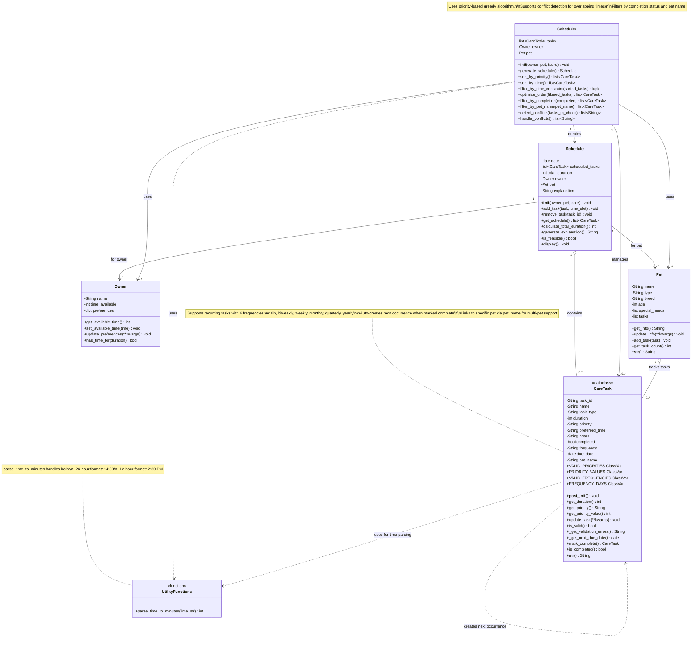

## Key Changes from Initial UML

### 🆕 New Features Added During Implementation

#### 1. **Recurring Task System**
- **New attributes in CareTask:**
  - `completed` (bool) - tracks completion status
  - `frequency` (String) - supports 7 frequencies (once, daily, biweekly, weekly, monthly, quarterly, yearly)
  - `due_date` (date) - when task is due
  - `pet_name` (String) - links task to specific pet

- **New methods in CareTask:**
  - `mark_complete()` - marks done and creates next occurrence
  - `is_completed()` - checks completion status
  - `_get_next_due_date()` - calculates next due date
  - `get_priority_value()` - returns numeric priority for sorting

- **New class variables in CareTask:**
  - `VALID_FREQUENCIES` - list of valid frequency strings
  - `FREQUENCY_DAYS` - dictionary mapping frequencies to day counts

#### 2. **Multi-Pet Support**
- **New attribute in Pet:**
  - `tasks` (list) - tracks tasks for this pet

- **New methods in Pet:**
  - `add_task(task)` - adds task to pet
  - `get_task_count()` - returns task count

- **New attribute in CareTask:**
  - `pet_name` (String) - links task to specific pet

- **New method in Scheduler:**
  - `filter_by_pet_name(pet_name)` - filters tasks by pet

#### 3. **Time Parsing & Sorting**
- **New module-level function:**
  - `parse_time_to_minutes(time_str)` - converts 12/24-hour formats to minutes

- **New method in Scheduler:**
  - `sort_by_time()` - sorts tasks chronologically using time parsing

#### 4. **Conflict Detection**
- **New methods in Scheduler:**
  - `detect_conflicts(tasks_to_check)` - identifies time overlaps
  - `handle_conflicts()` - wrapper for detecting conflicts in all tasks

#### 5. **Task Filtering**
- **New method in Scheduler:**
  - `filter_by_completion(completed)` - filters by completion status

### 📊 Implementation Stats

| Category | Initial UML | Final Implementation | Change |
|----------|------------|---------------------|---------|
| **Classes** | 5 | 5 + 1 utility | +1 |
| **CareTask attributes** | 7 | 11 | +4 |
| **CareTask methods** | 5 | 12 | +7 |
| **Pet attributes** | 5 | 6 | +1 |
| **Pet methods** | 3 | 5 | +2 |
| **Scheduler methods** | 5 | 9 | +4 |
| **Relationships** | 7 | 10 | +3 |

### 🔄 New Relationships

1. **CareTask → CareTask** - Creates next occurrence when recurring task is completed
2. **Pet → CareTask** - Pet tracks its own tasks
3. **Scheduler/CareTask → UtilityFunctions** - Both use time parsing helper

### ✅ Validation

All features in the UML diagram are now implemented and tested with **26 passing tests**:
- ✅ 9 core functionality tests
- ✅ 4 sorting & filtering tests
- ✅ 7 conflict detection tests
- ✅ 2 priority scheduling tests
- ✅ 4 AM/PM time format tests
